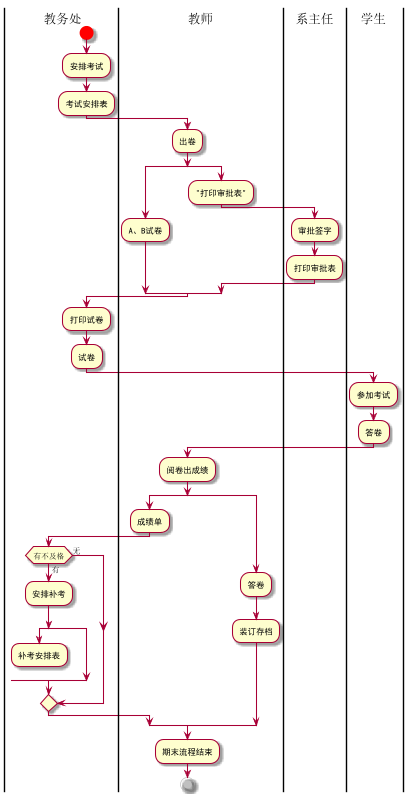

# 实验一
|学号|班级|姓名|照片|
|:-------:|:-------------: | :----------:|:---:|
|201610414422|软件(本)16-4|肖清宇|;
## 流程图1 考试与成绩管理流程

### PlantUML 源码如下
```
@startuml
|教务处|
start
:安排考试;
:考试安排表;
|教师|
:出卷;
split
:A、B试卷;
split again
:"打印审批表";
|系主任|
:审批签字;
:打印审批表;
end split
|教务处|
:打印试卷;
:试卷;
|学生|
:参加考试;
:答卷;
|教师|
:阅卷出成绩;
split
:成绩单;
|教务处|
if(有不及格) then (有)
:安排补考;
split
:补考安排表;
detach
split again
 end split
endif
split again
|教师|
:答卷;
:装订存档;
|教师|
end split
:期末流程结束;
stop
@enduml``
```

### 业务流程图如下:


### 流程说明

## 流程图2 客户维修服务流程

### PlantUML 源码如下
```
@startuml
|客户|
start
:申请服务;
|业务经理|
if(是新客户吗？) then(是)
:登录客户信息;
else(不是)
endif
:上门勘察;
:制定方案;
|客户|
if(满意吗？) then(否)
stop
else(是)
:签订服务合同;
endif
|业务经理|
fork
:安排工人;
fork again
:安排材料;
end fork
:填写派工单;
|工人|
:领取材料;
:上门服务;
|客户|
:验收并填写反馈意见;
|业务经理|
:交回派工单;
|财务人员|
:结算收款;
stop
@enduml
```

### 业务流程图如下:


### 流程说明