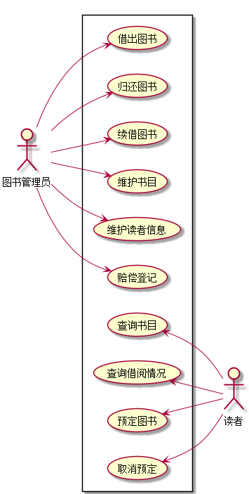

# 实验二 图书管理系统用例建模

## 用例图
### PlantUML源码
```flow js
@startuml
actor 图书管理员 as Admin
actor 读者 as User
left to right direction
rectangle {
  Admin --> (借出图书)
  Admin --> (归还图书)
  Admin --> (续借图书)
  Admin --> (维护书目)
  Admin --> (维护读者信息)
  Admin --> (赔偿登记)
  (查询书目) <--  User
  (查询借阅情况) <--  User
  (预定图书) <--  User
  (取消预定) <-- User
}
@enduml
```
### UML截图


## 用例表

### 1.借出图书用例表 | [前往](./借出图书.md)
### 2.归还图书用例表 | [前往](./归还图书.md)
### 3.续借图书用例表 | [前往](./续借图书.md)
### 4.维护书目用例表 | [前往](./维护书目.md)
### 5.维护读者信息用例表 | [前往](./维护读者信息.md)
### 6.维护读者信息用例表 | [前往](./赔偿登记.md)
### 7.查询书目用例表 | [前往](./查询书目.md)
### 8.查询借阅情况用例表 | [前往](./查询借阅情况.md)
### 9.预定图书用例表 | [前往](./预定图书.md)
### 10.取消预定用例表 | [前往](./取消预定.md)