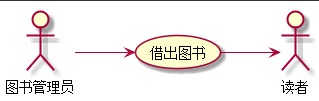

# 借出图书用例表 |[返回](./README.md)

<table>
<caption>借出图书用例规范</caption>
<tr>
    <td colspan="2"></td>
</tr>
<tr>
    <td>用例名称</td><td>借出图书</td>
</tr>
<tr>
    <td>参与者</td><td>图书管理员（主要参与者）、读者（次要参与者）</td>
</tr>
<tr>
    <td>前置条件</td><td>图书管理员已被授权并已登录系统</td>
</tr>
<tr>
    <td>后置条件</td><td>存储读者借书纪录，更新借出书本库存数量，所借图书状态更新为借出</td>
</tr>
<tr>
    <td colspan="2">主事件流</td>
</tr>
<tr>
    <td>参与者动作</td>
    <td>系统行为</td>
</tr>
<tr>
    <td>
        1.图书管理员将读者借书卡提供给系统  
        3.图书管理员将读者所借图书输入系统
    </td>
    <td> 
        2.系统验证读者身份和借书条件  
        4.系统纪录借书信息，并且修改图书状态和此种书的可借数量 
        5.系统累加读者的借书数量 
        6.重复3~5，直到图书管理员确认全部图书等级完毕 
        7.系统打印借书清单，交易成功完成
    </td>
</tr>
<tr>
    <td colspan="2">备选时间流</td>
</tr>
<tr>
<td colspan="2">
    2a.非法读者 
    &nbsp;&nbsp;&nbsp;&nbsp;1.系统提示错误并拒绝接受输入 
    2b.读者借书数已达限额 
    &nbsp;&nbsp;&nbsp;&nbsp;1.系统提示错误并拒绝接受输入 
    5a.读者借书数已达限额 
        &nbsp;&nbsp;&nbsp;&nbsp;1.系统提示，并要求结束输入 
        &nbsp;&nbsp;&nbsp;&nbsp;2.图书管理员确认借书完成 
    5b.读者有该书的预定纪录 
            &nbsp;&nbsp;&nbsp;&nbsp;1.删除该书的预定信息 
            &nbsp;&nbsp;&nbsp;&nbsp;2.系统提示重新输入借书信息 
            &nbsp;&nbsp;&nbsp;&nbsp;2.系统提示，并要求结束输入 
</td>
</tr>
<tr>
    <td colspan="2">业务规则</td>
</tr>
<tr>
    <td colspan="2">
        1.图书管理员必须在系统中存在信息
    </td>
</tr>
</table>