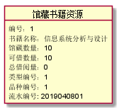

# 实验三 图书管理系统领域对象建模

## 1.图书管理系统的类图
### 1.1. 类图源码

```flow js
@startuml
管理员  --  系统配置:配置
管理员  --  管理员权限:分配
资源记录 <|--  资源类型
馆藏目录 "1"  -- "n" 馆藏书籍资源
馆藏书籍资源 "n" *-- "1" 资源记录:拥有
馆藏书籍资源  "1" <|-- "1.. n" 图书品种
馆藏书籍资源  "1" <|-- "1.. n" 图书类型
预定信息 "n" *-- "1" 读者信息:拥有
资源记录 "1" -- "0.. 1" 预定信息:属于
预定信息 "n" *-- "1" 馆藏书籍资源:被预定
资源记录 "1" -- "0.. 1" 借阅记录:属于
资源记录 "1" -- "0.. 1" 逾期记录:属于
借阅记录 "n" *-- "1" 读者信息:借阅
管理员 "1" *-- "n" 借阅记录:登记
逾期记录 "0.. 1" *-- "1" 借阅记录
逾期记录 "n" *-- "0.. 1" 罚款细则:使用
class 管理员{
职工号
姓名
}
class 管理员权限{
权限
}
class 系统配置{
读者可同时借阅书籍限额
借书规定时间
书籍可续借次数
}
class 资源记录{
流水号
时间
}
class 资源类型{
名称
}
class 馆藏目录{

}
class 馆藏书籍资源{
书籍名称
馆藏库存数量
可借数量
总借阅量
}
class 图书类型{
名称
}
class 图书品种{
ISBN编码
作者
价格
简介
出版社
出版日期
版本
}
class 预定信息{
预定日期
预定书籍
}
class 读者信息{
姓名
身份证号
借书卡号
已借图书数量
逾期次数
}

class 借阅记录{
借书日期
归还日期
}
class 逾期记录{
预期天数
}
class 罚款细则{
规则规定
罚款倍数
}
@enduml
```

### 1.2. 类图


### 1.3. 类型说明
>1

## 2. 图书管理系统的对象图
### 2.1 类"管理员"的对象图
#### 对象图源码
```flow js
@startuml

object 管理员{
职工号：0123456789
姓名：张三
权限编号：1
}

@enduml
```
#### 对象图


### 2.2 类"管理员权限"的对象图
#### 对象图源码
```flow js
@startuml

object 管理员权限{
编号：1
权限：系统管理、图书管理、借阅管理
}

@enduml
```
#### 对象图


### 2.3 类"系统配置"的对象图
#### 对象图源码
```flow js
@startuml

object 系统配置{
借阅限额：3
借书时间：30天
可续借次数：1
}

@enduml
```
#### 对象图


### 2.4 类"馆藏书籍资源"的对象图
#### 对象图源码
```flow js
@startuml

object 馆藏书籍资源{
编号：1
书籍名称：信息系统分析与设计
馆藏数量：10
可借数量：10
总借阅量：0
类型编号：1
品种编号：1
}

@enduml
```
#### 对象图


### 2.5 类"图书品种"的对象图
#### 对象图源码
```flow js
@startuml

object 图书品种{
编号：1
ISBN编码：978-7-302-32982-4
作者：王晓敏、邝孔武
价格: 45
简介: 信息系统分析与设计教材
出版社：清华大学出版社
出版日期：2013年8月
版本 4
}

@enduml
```
#### 对象图


### 2.6 类"图书类型"的对象图
#### 对象图源码
```flow js
@startuml

object 图书类型{
编号: 1
名称: 计算机
}

@enduml
```
#### 对象图


### 2.7 类"资源记录"的对象图
#### 对象图源码
```flow js
@startuml

object 资源记录{
流水编号：2019040801
时间：2019-04-08
资源类型编号：1
流水绑定记录编号：1 / 1-1,1-2
}


@enduml
```
#### 对象图


### 2.8 类"资源类型"的对象图
#### 对象图源码
```flow js
@startuml

object 资源类型{
编号：1
名称：书籍
编号：2
名称：借阅
}

@enduml
```
#### 对象图


### 2.9 类"预定信息"的对象图
#### 对象图源码
```flow js
@startuml

object 预定信息{
预定日期: 2019-4-8
预定书籍数据编号: 1-1
预定读者编号：1
}

@enduml
```
#### 对象图


### 2.10 类"读者"的对象图
#### 对象图源码
```flow js
@startuml

object 读者{
借书卡号：201610414422
姓名：肖清宇
身份证号:513258468
已借图书数量:12
逾期次数:2
}

@enduml
```
#### 对象图


### 2.11 类"借阅记录"的对象图
#### 对象图源码
```flow js
@startuml

object 借阅记录{
编号: 1
借书日期: 2019-3-8
归还日期: 209-4-7
借阅读者借书卡号：21610414422
登记管理员职工号：0123456789
}

@enduml
```
#### 对象图


### 2.12 类"逾期记录"的对象图
#### 对象图源码
```flow js
@startuml

object 逾期记录{
编号: 1
预期天数：3
借阅编号：1
罚款编号：1
罚款：30
}

@enduml
```
#### 对象图


### 2.13 类"罚款细则"的对象图
#### 对象图源码
```flow js
@startuml

object 罚款细则{
编号：1
规则规定：逾期3天以内
罚款倍数：1.1
}

@enduml
```
#### 对象图
