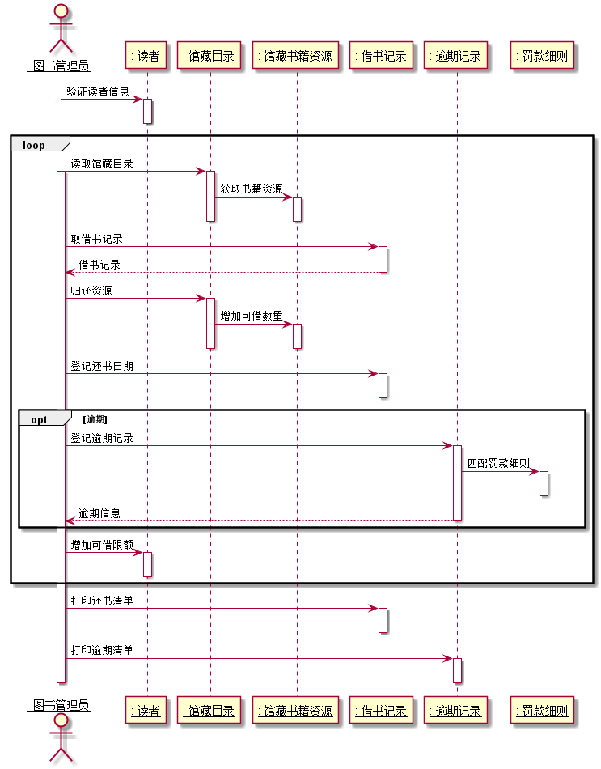

# 实验三 图书管理系统顺序图绘制

## 图书管理系统顺序图
### 1.借出图书
#### 源码
```flow js
@startuml
actor ": 图书管理员" as 图书管理员
participant ": 读者" as 读者
participant ": 馆藏目录" as 馆藏目录
participant ": 馆藏书籍资源" as 馆藏书籍资源
participant ": 借书记录" as 借书记录
skinparam sequenceParticipant underline
图书管理员 -> 读者:验证读者
activate 图书管理员
loop
activate 读者
deactivate 读者
图书管理员 -> 读者:取读者限额
activate 读者
opt 超出限额
读者-->图书管理员:取消借书操作
deactivate 读者
end
图书管理员 -> 馆藏目录:获取馆藏目录
activate 馆藏目录
馆藏目录 -> 馆藏书籍资源:查找书籍资源
activate 馆藏书籍资源
deactivate 馆藏书籍资源
deactivate 馆藏目录
图书管理员 -> 借书记录:创建借书记录
activate 借书记录
deactivate 借书记录
图书管理员 -> 馆藏目录:借出资源
activate 馆藏目录
馆藏目录 -> 馆藏书籍资源:减少可借数量
activate 馆藏书籍资源
deactivate 馆藏书籍资源
deactivate 馆藏目录
图书管理员 -> 读者:减少可借限额
activate 读者
deactivate 读者
end
图书管理员 -> 借书记录:打印借书清单
activate 借书记录
deactivate 借书记录
deactivate 图书管理员
@enduml
```
#### 顺序图

#### 说明
读者借书时，读者将借阅书籍与读者卡交与管理员，管理员判断对书籍与读者分别进行验证，验证读者是否存在借书条件，
并判断读者借书限额，之后查询书籍信息与品种，两种验证均通过的情况下，借书成功，减少库内书籍数量，减少读者可借书
数，在借书操作循环完成后，打印读者借书清单。
### 1.归还图书与赔偿登记
#### 源码
```flow js
@startuml
actor ": 图书管理员" as 图书管理员
participant ": 读者" as 读者
participant ": 馆藏目录" as 馆藏目录
participant ": 馆藏书籍资源" as 馆藏书籍资源
participant ": 借书记录" as 借书记录
participant ": 逾期记录" as 逾期记录
participant ": 罚款细则" as 罚款细则
skinparam sequenceParticipant underline
图书管理员 -> 读者:验证读者信息
activate 读者
deactivate 读者
loop
图书管理员 -> 馆藏目录:读取馆藏目录
activate 图书管理员
activate 馆藏目录
馆藏目录 -> 馆藏书籍资源:获取书籍资源
activate 馆藏书籍资源
deactivate 馆藏书籍资源
deactivate 馆藏目录
图书管理员 -> 借书记录:取借书记录
activate 借书记录
借书记录 --> 图书管理员:借书记录
deactivate 借书记录
图书管理员 -> 馆藏目录:归还资源
activate 馆藏目录
馆藏目录 -> 馆藏书籍资源:增加可借数量
activate 馆藏书籍资源
deactivate 馆藏书籍资源
deactivate 馆藏目录
图书管理员 -> 借书记录:登记还书日期
activate 借书记录
deactivate 借书记录
opt 逾期
图书管理员 -> 逾期记录:登记逾期记录
activate 逾期记录
逾期记录->罚款细则:匹配罚款细则
activate 罚款细则
deactivate 罚款细则
逾期记录 --> 图书管理员:逾期信息
deactivate 逾期记录
end
图书管理员->读者:增加可借限额
activate 读者
deactivate 读者
end
图书管理员 -> 借书记录:打印还书清单
activate 借书记录
deactivate 借书记录
图书管理员 -> 逾期记录:打印逾期清单
activate 逾期记录
deactivate 逾期记录
deactivate 图书管理员
@enduml


```
#### 顺序图

#### 说明
读者归还图书时，将需要归还的书籍和读者卡交给图书管理员，图书管理员首先对读者进行验证，验证是否读者是否可借还书，

通过验证后，依次读取馆藏目录与馆藏书籍资源，验证书籍与品种信息是否存在馆藏信息中，存在则继续进行归还处理，

图书管理员读取读者借书记录，查找读者是否正在借阅该图书，

如过借阅信息存在，则继续进行归还操作，增加书籍资源库存数目，登记借书记录还书日期，同时判断是否逾期，超过预期归还
时间，若超过，进行逾期记录登记，

逾期记录登记完成后增加读者可借书限额，一次归还操作完成，根据读者是否需要归还多本书进行循环，循环完成后打印还书清单与逾期清单