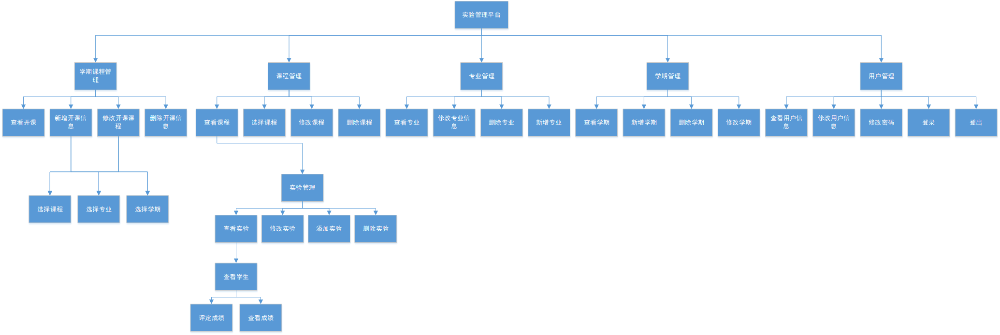

# 基于GitHub的实验管理平台的分析与设计

## 1.概述

- 基于GitHub的实验管理平台的作用是在线管理实验成绩的Web应用系统。学生和老师的实验内容均存放在GitHUB 页面上。
## 2.系统总体结构 

## 3.用例图设计 [源码]()

## 4.类图设计 [源码](类图.puml)

## 5.数据库设计

[详情](DB/README.md)

## 6.用例及界面详细设计
