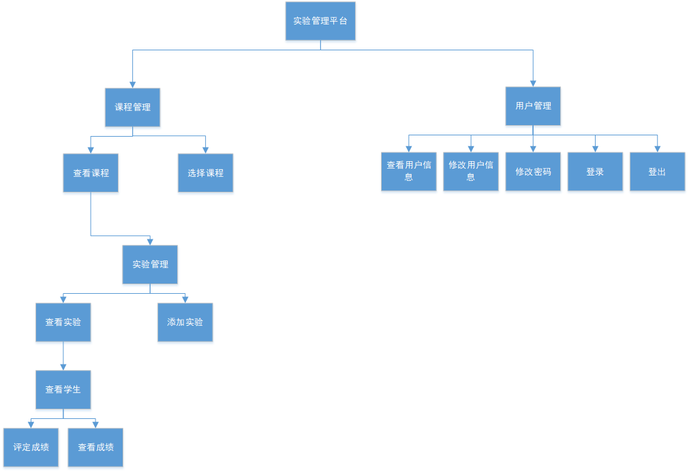

# 基于GitHub的实验管理平台的分析与设计

## 1.概述

- 基于GitHub的实验管理平台的作用是在线管理实验成绩的Web应用系统。学生和老师的实验内容均存放在GitHUB 页面上。
- 
## 2.系统总体结构 

## 3.用例图设计 [源码](源码/总设计.puml)

## 4.类图设计 [源码](源码/类图.puml)

## 5.数据库设计

[详情](DB/README.md)

## 6.用例及界面详细设计
1.[登录用例](./用例/登录.md) [界面](https://Everythingtomyheart.github.io/is_analysis_pages/test6/ui/登录.html)

2.[登出用例](./用例/登出.md) [界面](https://Everythingtomyheart.github.io/is_analysis_pages/test6/ui/登出_顶部菜单.html)

3.[修改密码](./用例/修改密码.md)  [界面](https://Everythingtomyheart.github.io/is_analysis_pages/test6/ui/修改密码.html)

4.[修改用户信息](./用例/修改用户信息.md)  [界面](https://Everythingtomyheart.github.io/is_analysis_pages/test6/ui/修改用户信息.html)

5.[查看用户信息](./用例/查看用户信息.md)  [界面](https://Everythingtomyheart.github.io/is_analysis_pages/test6/ui/查看用户信息.html)

6.[选择课程](./用例/选择课程.md)  [界面](https://Everythingtomyheart.github.io/is_analysis_pages/test6/ui/选择课程.html)

7.[查看课程](./用例/查看课程.md)  [界面](https://Everythingtomyheart.github.io/is_analysis_pages/test6/ui/查看课程.html)

8.[查看学生信息](./用例/查看学生信息.md)  [界面](https://Everythingtomyheart.github.io/is_analysis_pages/test6/ui/查看学生信息.html)

9.[查看实验](./用例/查看实验.md)  [界面](https://Everythingtomyheart.github.io/is_analysis_pages/test6/ui/查看实验.html)

10.[发布实验](./用例/发布实验.md)  [界面](https://Everythingtomyheart.github.io/is_analysis_pages/test6/ui/发布实验.html)

11.[查看成绩](./用例/查看成绩.md)  [界面](https://Everythingtomyheart.github.io/is_analysis_pages/test6/ui/查看成绩.html)

12.[评定成绩](./用例/评定成绩.md)  [界面](https://Everythingtomyheart.github.io/is_analysis_pages/test6/ui/评定成绩.html)