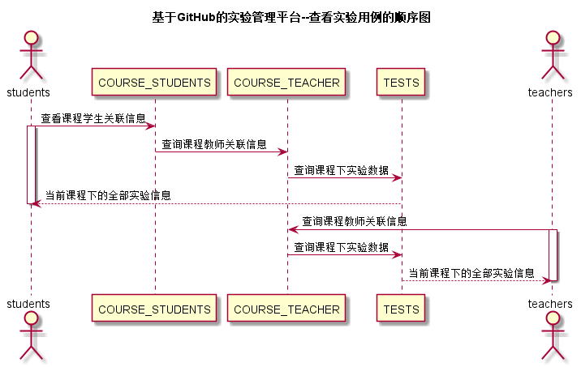

# “查看实验”用例 [返回](../README.md)

## 1. 用例规约

|用例名称|查看实验|
|-------|:-------------|
|功能|查询当前课程下已发布的全部实验|
|参与者|学生/老师|
|前置条件| |
|后置条件| |
|主事件流| 1. 查询实验信息|
|备选事件流|1a.查询失败  &nbsp;&nbsp; 1.系统提示查询失败|

## 2. 业务流程 [源码](../源码/查看实验.puml)
 

## 3. 界面设计
- 界面参照: https://Everythingtomyheart.github.io/is_analysis_pages/test6/ui/查询实验.html
- API接口调用
    - 接口1：[getCourseAllTests](../接口/getCourseAllTests.md)

## 4. 算法描述
    无
## 5. 参照表
- [COURSE_TEACHER](../DB/README.md/#COURSE_TEACHER)
- [COURSE_STUDENTS](../DB/README.md/#COURSE_STUDENTS)
- [TESTS](../DB/README.md/#TESTS)